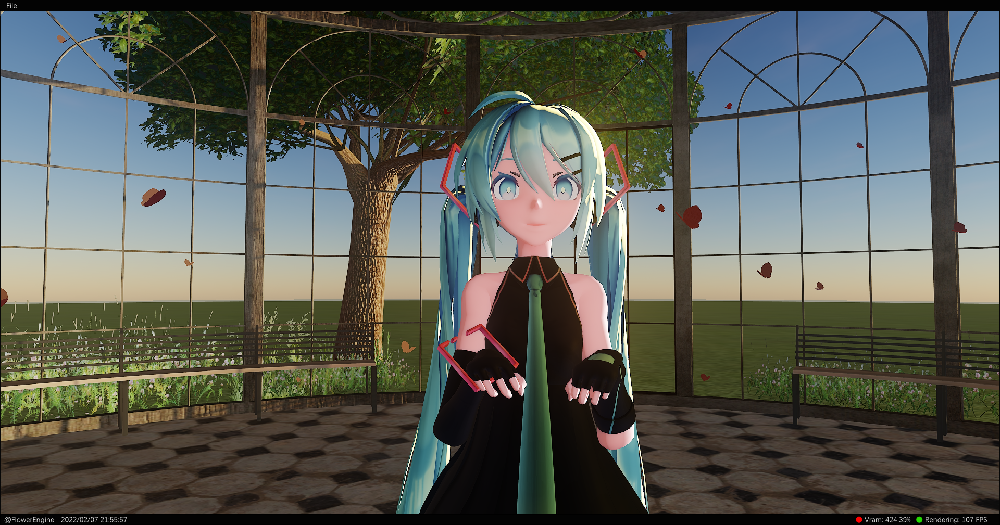

### *This page is used to showcase some software that I have developed in my spare time. They integrate some advanced real-time rendering algorithms for creating videos similar to miku-miku-dance.* 

These software are listed in chronological order from the latest development to the time when I started learning C++. The list will be continuously updated as time goes on. I hope you can find useful information from it.

## 2021/06 ~ 2023/03

***project - flower**:  https://github.com/qiutangu/flower*

This is a realtime miku fan-made free miku-miku-dance renderer, which render with vulkan api, implemented a simple engine architecture.

Features:

- GPU Dispatch Sample Distribution Shadow Maps.
- GPU Dispatch Rendering Pipeline.
- Bindless Material System.
- Deferred Shading Pipeline.
- PBS Shading System.
- Postprocessing effects.
- Precompute Atmosphere.

Some screenshot list in gallery, enjoy~

It also produced a series of video works, next, let's list the inventory.

- Done in 2022/01: https://www.bilibili.com/video/BV1HA411C7DG or https://youtu.be/8xkQ8aj9syg

- Done in 2021/12: https://www.bilibili.com/video/BV1FL4y147DN or https://youtu.be/ciw8UOmaFaI

Reference：

- https://github.com/andy-thomason/Vookoo 
- https://github.com/USCiLab/cereal
- https://vkguide.dev/docs/gpudriven/gpu_driven_engines
- https://vkguide.dev/docs/extra_chapter

## 2020/05 ~ 2021/07

***project - simple vulkan renderer**:  https://github.com/qiutanguu/SimpleVulkanRenderer*

*video link: https://www.bilibili.com/video/BV14f4y1a7io*

Features:

- Deferred shading.
- PCSS Soft Shadow.

This is the first Vulkan renderer that I wrote. I started learning from Alexander's Vulkan tutorial and went through it repeatedly. After around seven months, I completed his tutorial and began integrating some effects from SaschaWillems' sample projects into my renderer. Over the course of a year, I slowly tried and deepened my understanding of Vulkan.

Vulkan is a very complicated API that requires a lot of practice and hands-on experience to gradually master. However, as a reward, one can learn a lot of knowledge related to GPU hardware during this process.

Reference：

- SaschaWillems's vulkan samples: https://github.com/SaschaWillems/Vulkan。
- https://vulkan-tutorial.com/
- https://github.com/ARM-software/vulkan-sdk/tree/master/samples
- https://gpuopen.com/learn/hellovulkan-introductory-vulkan-sample/

## 2019/11 ~ 2020/03

***project - openGL graphics**:  https://github.com/qiutanguu/OpenGL-Graphics*

Features:

- Shadow/PBR/IBL/SSAO/Bloom/Instance/Deffered/NormalMap...

By the end of 2019, TheCherno's GameEngine 2D series on Youtube was nearing completion.

Following his tutorials, I was able to build an engine framework and after completing it, I started writing an OpenGL graphics renderer and implemented common graphics rendering effects.

Reference：

- https://www.youtube.com/watch?v=JxIZbV_XjAs&t=5s
- https://learnopengl-cn.github.io/
- https://github.com/JoshuaSenouf/gl-engine
- https://github.com/Angelo1211/HybridRenderingEngine
- https://github.com/Nadrin/PBR

## 2019/03 ~ 2019/09

***project - software renderer**: https://github.com/qiutanguu/SoftwareRenderer*

*video link:  https://www.bilibili.com/video/BV1sJ411H7Hk*

Features:

- pure win32, no dependency.
- scriptable shader function.
- z-buffer test.
- .obj mesh parser.
- interactive render scene.
- perspective correction lerp.

After learning C++ and linear algebra, it became possible for me to create a software rasterizer. The tiny series courses by ssloy are very suitable for beginners in programming. 

After completing all the wiki courses of tiny Renderer, I referenced skywind3000's mini3d project and wrote a Win32 software rasterizer window program. It implements common operations such as rotation, scaling, and translation of models. Finally, I also made a simple Bezier surface editor.

Reference：

- https://github.com/ssloy/tinyrenderer/wiki
- https://github.com/ssloy/tinyrenderer/wiki